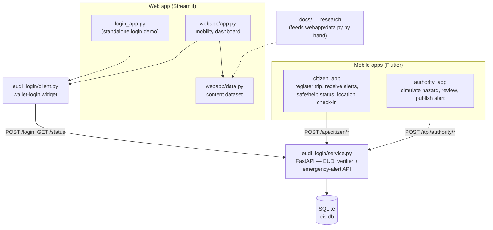
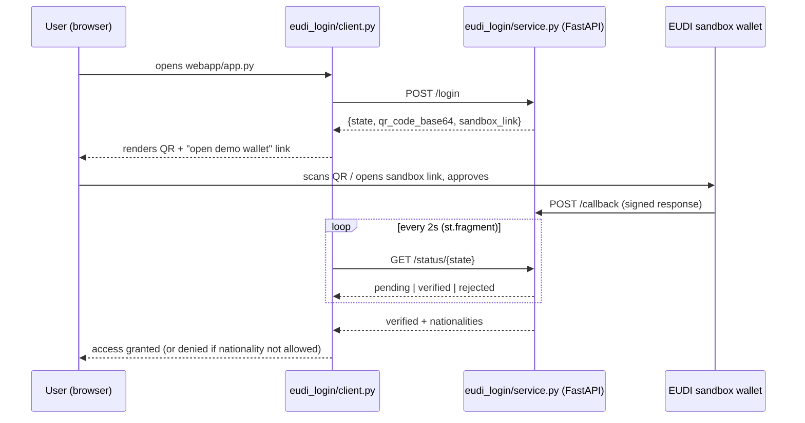
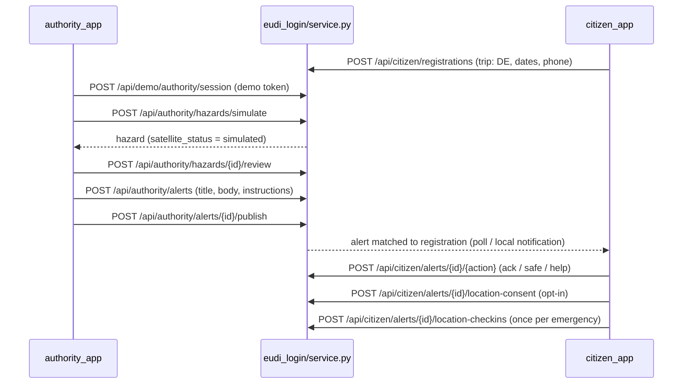

# EIS — European Impact Sprints

**EU Data Compass** — a unified European mobility platform. One place to find out what you need
to do when you **travel to** or **move into** another EU country, gated behind an **EU Digital
Identity Wallet** sign-in, plus a demo of the **emergency-alert layer** that becomes possible once
citizens are wallet-verified.

> **Worked example:** Portuguese citizens → Germany (Berlin). Third-country validation: Spain.
> Everything else in the EU is present but marked as draft/unverified data.

---

## What's actually in this repo

Three parts, one repo:

| Part | Where | What |
|---|---|---|
| **Web app** | `login_app.py`, `eudi_login/`, `webapp/` | EUDI Wallet OpenID4VP verifier (FastAPI) + Streamlit mobility dashboard |
| **Mobile apps** | `mobile/citizen_app/`, `mobile/authority_app/` | Flutter demo of the emergency-alert flow (citizen + authority sides) |
| **Research & spec** | `docs/` | Full platform spec, subcategory research, sources, PDF forms |

## Architecture



The web app and the mobile apps talk to the **same backend** (`eudi_login/service.py`) but exercise
different parts of it: the web app uses the wallet-login endpoints (`/login`, `/callback`,
`/status/{state}`); the mobile apps use the emergency-alert endpoints (`/api/citizen/*`,
`/api/authority/*`), authenticated with a separate demo bearer token, not a full wallet check (see
[What's mocked](#whats-mocked--not-built) below).

## What works today

| Area | Status |
|---|---|
| **EUDI Wallet login gate** (web app) | Works — issues an SVG QR, polls for approval, checks nationality against `ALLOWED_NATIONALITIES`. Uses the **EUDI sandbox** (`eudi-test.dev`), not a production wallet. |
| **Germany content** (web app) | Real, sourced content for **all 8 subjects** — Residence, Work, Studies, Tax, Health, Social security, Vehicle, Family — for both traveling and moving in. |
| **Germany short-stay business-travel demo** | A dedicated "Berlin conference" scenario (`webapp/data.py:_germany_traveling`) with its own deadlines/documents/info, reachable via the **"Try the Berlin conference demo"** button on the destination-picker screen. |
| **Spain content** (web app) | Real, sourced content for the moving-in case. |
| **Other 25 countries** (web app) | Universal short-stay (< 3 months) content is real for everyone. Long-stay content comes from a draft 27-country matrix and is badged **unverified** in the UI. |
| **Inform with ID** (web app) | A full, working prototype flow: draft a travel notification → review → "approve with EU Wallet (demo)" → stored in the browser session, with a data-retention/privacy explainer tab. |
| **Document sign / wallet-add** (web app) | Each document card can open a **mock wallet-signing dialog** that "signs" and returns a downloadable demo PDF. No real cryptographic signature. |
| **Emergency alert demo** (mobile) | End-to-end: authority app simulates a hazard → reviews it → publishes an alert; citizen app receives it, can acknowledge, mark safe/need-help, and share location once per emergency (with explicit consent). Backed by real SQLite tables (`hazards`, `alerts`, `alert_recipients`, `location_consents`, `location_checkins`, `audit_events`). |
| **Push notifications** (citizen app) | Local device notifications work (scheduled via `flutter_local_notifications`); this is **not** Firebase Cloud Messaging — the `devices`/FCM-token table exists in the backend but nothing sends real push yet. |

## What's mocked / not built

| Area | Status |
|---|---|
| **Identity verification** | The EUDI verifier is a **prototype**: no real signature/trust-chain verification, key-binding, revocation, replay protection, or signed request objects. It talks to the public EUDI *sandbox*, not a production wallet. |
| **Mobile app auth** | The citizen/authority Flutter apps authenticate with a throwaway **demo bearer token** (`POST /api/demo/{citizen,authority}/session`), not the EUDI wallet flow the web app uses. Wiring the mobile apps into the real wallet login is unbuilt. |
| **Satellite hazard detection** | `hazards.provider` / `satellite_status` are hard-coded to `"simulated"`. There is no real Copernicus (or other) satellite ingestion — see [`docs/12-EMERGENCY-ROUTING-PROPOSAL.md`](docs/12-EMERGENCY-ROUTING-PROPOSAL.md) for the target design. |
| **Cross-border alert routing** | The routing-proposal document's "home country relays the alert to its own citizens abroad" design (eDelivery/AS4, IMI, etc.) is a **proposal only** — this repo implements a single-country demo (one backend, one country's authority, one country's citizens), not country-to-country routing. |
| **Real push delivery** | No Firebase/APNs wiring. Alerts reach the citizen app only while it's open and polling/locally notified during the same demo session. |
| **Production persistence** | SQLite file (`eis.db`), no migrations, no backups, in-memory session dict for wallet logins (`SESSIONS`, `DEMO_SESSIONS` — lost on restart). Fine for a demo, not for production. |
| **Subject coverage outside Germany/Spain** | Work/Studies/Tax/Health/Social security/Vehicle/Family guides only exist for **Germany**. Every other country only has the universal short-stay baseline plus (for the 8 draft countries) a rough long-stay matrix entry. |
| **Multi-page portal** | The Streamlit app is a **single-page prototype** covering one dashboard. The actual build target (site map, full page flows) is [`docs/01-plan/IMPLEMENTATION-PLAN.md`](docs/01-plan/IMPLEMENTATION-PLAN.md). |

## Flows

### Wallet login (web app)



### Emergency alert (mobile demo)



See [`docs/07-emergency/EMERGENCY-DEMO.md`](docs/07-emergency/EMERGENCY-DEMO.md) for the full API
reference and data model, and [`docs/12-EMERGENCY-ROUTING-PROPOSAL.md`](docs/12-EMERGENCY-ROUTING-PROPOSAL.md)
for the country-to-country design this demo is a first slice of.

## Launch

```bash
python3 -m venv .venv
.venv/bin/pip install -r requirements.txt
```

### Docker modes

The Docker deployment runs FastAPI, Streamlit, and Nginx together behind one
public port. Railway supplies HTTPS in deployment; local development can use
Docker Compose plus `cloudflared`:

```bash
docker compose up --build
cloudflared tunnel --url http://localhost:8080
```

See `webapp/README.md` for the full local and Railway configuration, including
`PUBLIC_BASE_URL` and `EUDI_API_URL`.

### Emergency mobile demo

The Android-first Flutter clients are in `mobile/citizen_app` and
`mobile/authority_app`. They run **standalone with mock data by default** — no
backend needed. Run the backend with Docker if you want the real API instead;
see `mobile/README.md` for both modes.

Test against the public sandbox **eudi-test.dev** (needs https to reach your `/callback`).

### Local dev

The wallet QR gate is always on. The wallet POSTs its response to the verifier's `/callback`,
so the verifier must be reachable over **public HTTPS** — locally that means a tunnel (a stand-in
for the public URL you get for free on Railway).

```bash
# Terminal 1 — tunnel (gives you a public HTTPS URL for :5000)
cloudflared tunnel --url http://localhost:5000        # or: ngrok http 5000

# Terminal 2 — verifier service. PUBLIC_BASE_URL = the tunnel URL from Terminal 1.
PUBLIC_BASE_URL=https://your-tunnel.trycloudflare.com \
  .venv/bin/uvicorn eudi_login.service:app --host 0.0.0.0 --port 5000 --reload

# Terminal 3 — the gated EIS dashboard.
EUDI_API_URL=http://localhost:5000 \
ALLOWED_NATIONALITIES=PT,DE,FR,NL,IT,ES,SK \
  .venv/bin/streamlit run webapp/app.py --server.port 8501
```

FastAPI auto-docs: **http://localhost:5000/docs**. Standalone login demo (optional):
`EUDI_API_URL=http://localhost:5000 .venv/bin/streamlit run login_app.py --server.port 8502`.

### Deploy (Railway) — no tunnel

Railway hands each service a public HTTPS domain, which **replaces the tunnel**. See
[`DEPLOY.md`](DEPLOY.md).

## Documentation — `docs/`

```
docs/
├── 01-plan/IMPLEMENTATION-PLAN.md   # master build plan (start here)
├── 02-spec/                         # PLATFORM-SPEC, PLATFORM-CONCEPT, EUDI-WALLET
├── 03-cases/                        # SUBCATEGORIES + cases/ (7 subcategory docs)
├── 04-research/                     # personas, cases, documents index, country matrix
├── 05-resources/                    # sources, PDF URLs, assisting platforms
├── 06-subjects/                     # Work/Studies/Tax/Health/Social security/Vehicle/Family research
├── 07-emergency/EMERGENCY-DEMO.md   # what the emergency-alert demo actually implements (API + data model)
├── 12-EMERGENCY-ROUTING-PROPOSAL.md # emergency routing proposal — the target design (sibling-authored)
└── assets/pdf/                      # fetched forms (3 PDFs)
```

See [`docs/README.md`](docs/README.md) for the full index.

## Key verified facts

- **Travel <3 months:** valid ID only — no visa, no residence permit, no registration.
- **Move >3 months (Germany):** Anmeldung at Bürgeramt within **14 days** (fine up to €1,000);
  landlord confirmation required (lease alone isn't enough).
- **Deadline clocks differ per country:** DE 14 days · PT 30 days after month 3 · ES within 3 months.
- **EUDI Wallet:** ≥1 wallet per member state by **24 Dec 2026** (Regulation (EU) 2024/1183).

See `docs/01-plan/IMPLEMENTATION-PLAN.md` and `docs/README.md`.
